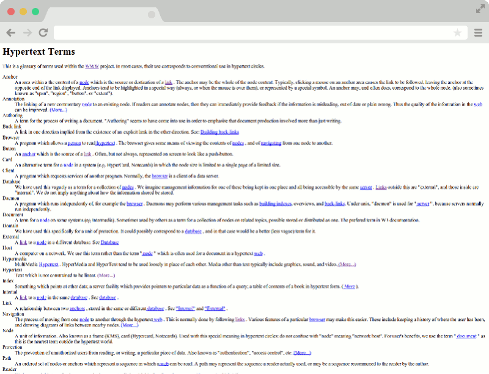

fixThisSite
===========

A simple chrome plugin to style unstyled pages

Look at the difference:

##Installation

This plugin is not in the chrome store because I don't want to pay $5. So you must follow this slightly more complex procedure:

1. Download the [zip file](https://github.com/GabrielD42/fixThisSite/releases) and unzip it
2. Open the Chrome menu and go to Settings > Extensions
3. Enable Developer Mode
4. Choose "Load unpacked extension"
5. Select the fixThisSite folder
6. Enjoy!

##Future Improvements
- [ ] load nice fonts from google
- [ ] popup menu with choices of what styles to add
- [x] detect if page has no styles and automatically enable
- [ ] remember which sites this plugin is enabled on

##Credit Where Credit is Due

I wrote almost none of the CSS, instead I borrowed parts from CSS frameworks and such I liked. Here is a partial list:

* Typography from [Typeplate](http://typeplate.com/)
* Links from [Ink](http://ink.sapo.pt/)
* Forms and Tables from [Core.css](http://codepen.io/oknoblich/pen/xBpbe)